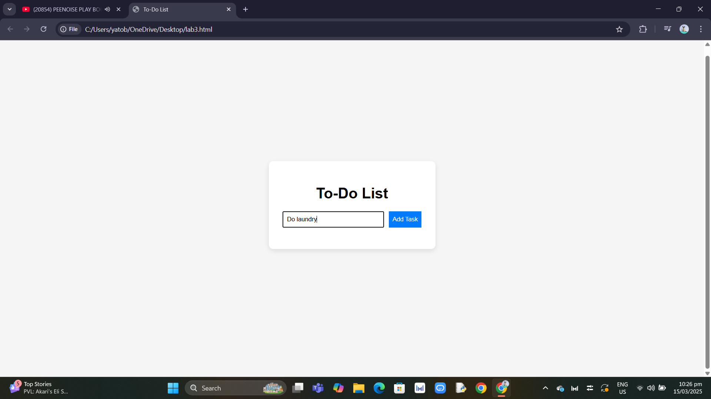
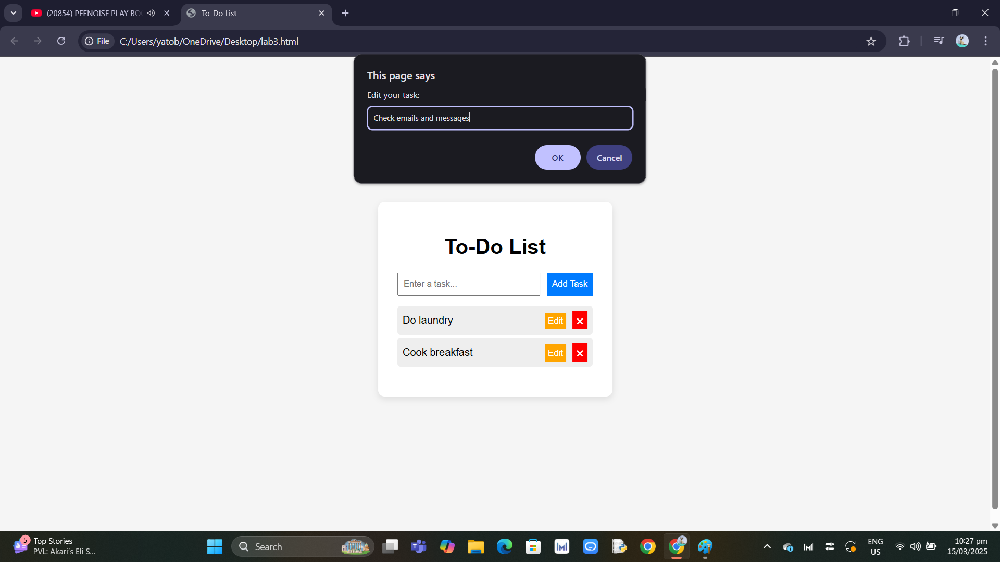
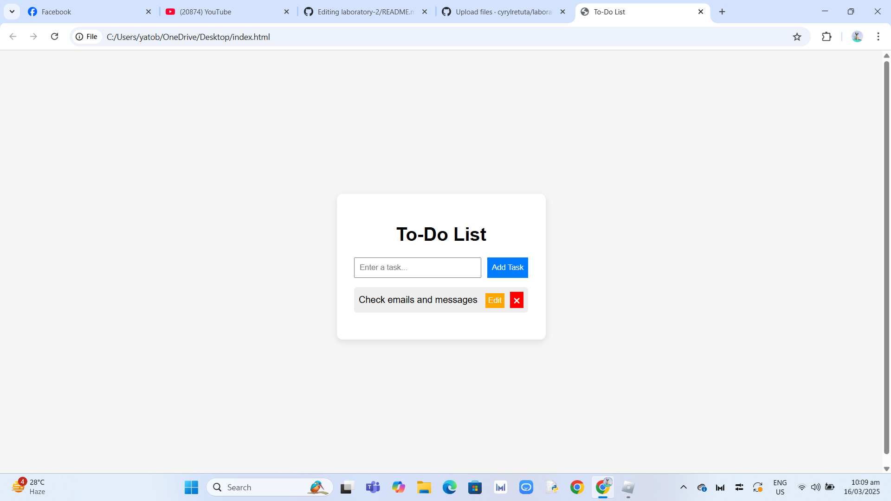
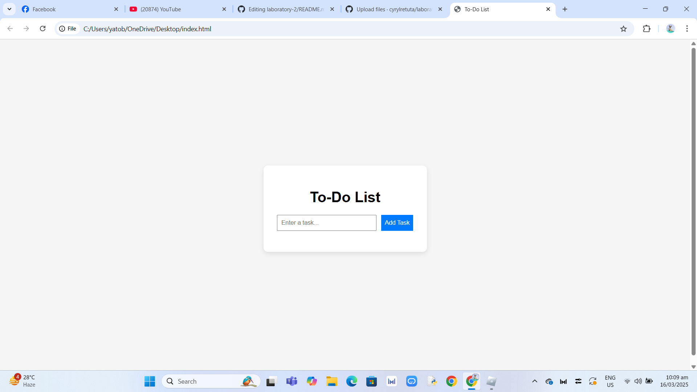

# To-Do List App

## Overview

- This is a simple To-Do List App built with HTML, CSS, and JavaScript (ES6+). It allows users to add, edit, and delete tasks while storing them in localStorage so that tasks remain saved even after refreshing the page.

## Features

- Add Tasks: Enter a task and click "Add Task" to store it.

- Edit Tasks: Click the Edit button to modify an existing task.

- Delete Tasks: Click the 🗙 button to remove a task.

- Persistent Storage: Uses localStorage to keep tasks even after page refresh.

- Smooth UI Updates: Tasks update dynamically without requiring a full page reload.

## JavaScript Features Used

## ES6+ Features

- Arrow Functions: Used for concise function definitions.

- Template Literals: Used for creating dynamic HTML elements.

- let & const: Used for variable declarations to avoid issues with global scope.

- Array Methods: Used .forEach() and .filter() for handling task storage.

## Event Listeners

- addEventListener() is used to handle:

- Clicking the "Add Task" button

- Editing tasks

- Deleting tasks

- Loading saved tasks from localStorage

## localStorage

- Saving Tasks: When a task is added, it is stored in localStorage.

- Retrieving Tasks: When the page loads, tasks are loaded from localStorage.

- Updating Tasks: When a task is edited, the change is reflected in localStorage.

- Deleting Tasks: Removing a task also removes it from localStorage.

## Screenshots

1️⃣ Adding a Task:

2️⃣ Editing a Task:

3️⃣ Deleting a Task:

## Code Quality

Efficient DOM Manipulation: Updates happen dynamically using JavaScript without reloading the entire page.

Proper Use of Event Listeners: Avoids unnecessary event bindings to ensure better performance.

Clean and Readable Code: Uses modern JavaScript best practices.

Minimal and Responsive UI: Styled with CSS for a clean look and better user experience.

## Deployment:
The site is hosted at: [Live Demo](https://cyrylretuta.github.io/laboratory-3/)
